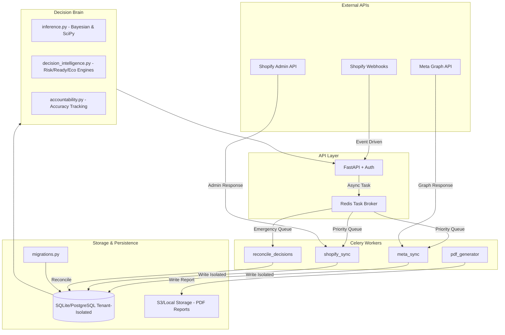

# TrueROAS System Architecture

This document details the technical structure, data processing, and multi-tenant isolation logic of the platform.

*Updated: 2026-06-03*
---

## 0. Core Working Principle

TrueROAS synchronizes attribution data reported by marketing platforms (Meta, Google) with actual bank-cleared sales (Shopify) using a "Reconciliation Filter" (Bayesian Filter).

```mermaid
flowchart LR
    subgraph Inputs [Raw Data]
        M[Meta: 4.0 ROAS (Platform Claim)]
        S[Shopify: Verified Sales (Bank Truth)]
    end

    subgraph Engine [TrueROAS Brain]
        B{Bayesian Reconciliation}
        B --> |Filter| R[Readiness Audit]
        R --> |Analysis| E[Economic Projection]
    end

    subgraph Output [Final Outcome]
        V[Verified Truth: 2.8 ROAS]
        A[Action: STRONG_SCALE, CAUTIOUS_SCALE, or REDUCE_OR_HOLD]
    end

    Inputs --> Engine --> Output
```

---
## 1. High-Level Architecture



---

## 2. Multi-Tenancy & Data Isolation
TrueROAS uses a **Hybrid Multi-Tenant Architecture** to support both Enterprise Cloud and On-Prem deployments:
- **Primary (Enterprise Cloud):** PostgreSQL with **Declarative Partitioning** and **Row Level Security (RLS)**. This allows a single cluster to securely manage 10,000+ tenants with sub-millisecond query isolation.
- **Secondary (Local-First):** Dedicated SQLite files per tenant located in `data/tenants/{tenant_id}/warehouse.db`. Ideal for brands requiring zero-cloud persistence.
- **Data Privacy:** PII (Personally Identifiable Information) is never stored raw. We use **BLAKE2b for hashing speed** combined with **HMAC-SHA256 for keyed integrity per tenant**, ensuring that even in a breach, customer data remains unrecoverable without the tenant-specific master salt.
- **Path Security:** Tenant IDs are sanitized to prevent directory traversal attacks.

---
## 2.2 Technical Enforcement of Local Execution Mandate
For Enterprise deployments, the platform's "Local-First" promise is technically enforced through four primary architectural constraints:

1. **In-Process Bayesian Computation:** All decision intelligence models (located in `src/trueroas/core/inference.py`) run as in-process calculations using `numpy` and `scipy`. There are no external API calls to third-party AI vendors (e.g., OpenAI, Claude) or side-car inference containers.
2. **Network Egress Filtering:** The system is designed to operate within an egress-filtered VPC. The application only requires outbound connectivity to Meta Graph and Shopify Admin APIs. No customer metadata or transaction telemetry is transmitted to external analytics providers.
3. **Dependency Lockdown:** The CI/CD pipeline (`ci.yml`) is configured to audit the environment, ensuring that no unauthorized LLM SDKs or proprietary cloud-inference libraries are introduced into the production image.
4. **Storage Sovereignty:** Data never leaves the tenant's isolated persistence layer (SQLite file or RLS-protected Postgres partition) during the reconciliation lifecycle. All "truth-filtering" is performed against local data snapshots.

---
## 2.1 Roadmap & Feature Maturity
- **BotGuard (Beta):** Heuristic analysis of CTR/CVR anomalies to flag low-quality traffic.
- **Inventory Sync (Roadmap):** Automated connection to Shopify inventory levels to prevent scaling out-of-stock items.
---

## 3. Automated Guardrails & Stakeholder Control

### 🛑 AdSpendBreaker (Circuit Breaker)
The system includes the **AdSpendBreaker** to protect capital. When "Hard Breaker" thresholds are met, the system can **optionally update campaign status to PAUSED** via the Meta API. 
*Note: Auto-pausing requires `ads_management` permission. For the first 7 days of deployment, we recommend "Alert-Only" mode to calibrate variance thresholds.*
sequenceDiagram
    participant A as Accountant
    participant R as Risk Manager
    participant M as Marketing Manager
    participant C as CEO

    A->>Logic: Set VARIABLE_COST
    Note over A,Logic: Monitor Attribution Variance
    
    R->>Logic: Match Rate & Confidence Audit
    Note over R,Logic: Monitor system errors (MAE/Bias)
    
    M->>Logic: Bottleneck (CTR/CR) Diagnosis
    Note over M,Logic: Implement Action Plan
    
    C->>Logic: EV & Delay Cost Monitoring
    Note over C,Logic: Authorize budget increase decision
```