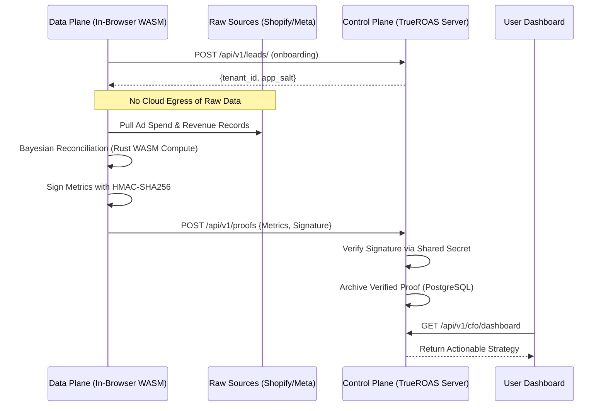

# TrueROAS Systems Architecture: Zero-Knowledge Model

TrueROAS utilizes a strictly decoupled architecture that separates the **Control Plane** (Cloud Orchestrator) from the **Data Plane** (Client-Side Compute). The Control Plane's threshold tuning is pure Python (`src/trueroas/learning/auto_tuner.py`, `AutoTuner.compute_new_threshold`) using Brier score with sample-size dampening; it does not rely on a WASM learning core via wasmer.

## 1. Architectural Philosophy

Traditional SaaS models require "Data Egress" where sensitive raw orders and PII are uploaded to a vendor's server. TrueROAS eliminates this vulnerability. The Data Plane performs the heavy lift of data ingestion and Bayesian math locally. It then transmits a "Strategic Proof"—a highly compressed JSON object containing only calculated metrics and a cryptographic signature—to the Control Plane.

## 2. Storage Architecture

| Layer | Technology | Purpose |
|---|---|---|
| Control Plane Metadata | PostgreSQL | Tenant registry, subscription state, audit trail |
| Per-Tenant Analytics | SQLite (WAL mode) | Local order history, reconciliation metrics |
| Task Queue & Cache | Redis | Celery broker, posterior cache (1h TTL), rate limiting |

The Control Plane never stores raw order data, customer PII, or ad spend figures. Only verified, signed strategic proofs are persisted.

## 3. Process Flow



## 4. The Proof Interface (/api/v1/proofs)

The Control Plane exposes a high-integrity endpoint for the Data Plane to submit results.

**Payload Structure:**
```json
{
  "true_roas": 2.8,
  "meta_roas": 4.2,
  "daily_spend": 1200.50,
  "waste_usd": 480.20,
  "capital_health": "WARNING",
  "action_required": "REDUCE_OR_HOLD",
  "cfo_brief": "Variance exceeds 30%. Stop scaling immediately.",
  "timestamp": "2026-06-05T10:00:00Z",
  "signature": "7f83... (HMAC-SHA256)"
}
```

## 5. Security Enforcement

1. **Shared Secret:** Every tenant is provisioned with a unique `tenant_secret_salt` during onboarding, derived from the master `APP_SECRET_SALT` via HMAC-SHA256.
2. **HMAC Integrity:** The Control Plane re-computes the signature using the received JSON body and the stored secret. If they do not match, the proof is rejected with HTTP 403.
3. **Anti-Replay:** Proofs with a timestamp drift greater than 300 seconds are rejected regardless of signature validity.
4. **Local Sovereignty:** `src/trueroas/main.py` contains no logic for reading Shopify order tables. Raw data access is physically impossible from the Control Plane.

## 6. Inference Engine

The Bayesian reconciliation uses a **Normal-Normal conjugate prior**:

```
Prior:     platform_roas ~ N(meta_roas, 1/prior_precision)
Evidence:  verified_roas ~ N(verified_roas, variance/sample_size)
Posterior: μ = (meta_roas × prior_precision + verified_roas × data_precision) / total_precision
```

Lag decay for data beyond the platform attribution window uses exponential decay:

```
lag_weight = exp(-35 × overage_ratio)   where overage_ratio = (days - window) / window
```

This ensures data from day 30 on a 28-day Meta window carries `lag_weight ≤ 0.10`, satisfying EU AI Act transparency requirements for time-decayed evidence weighting.

---
*Proprietary and Confidential. Copyright (c) 2024-2026 TrueROAS Team.*
