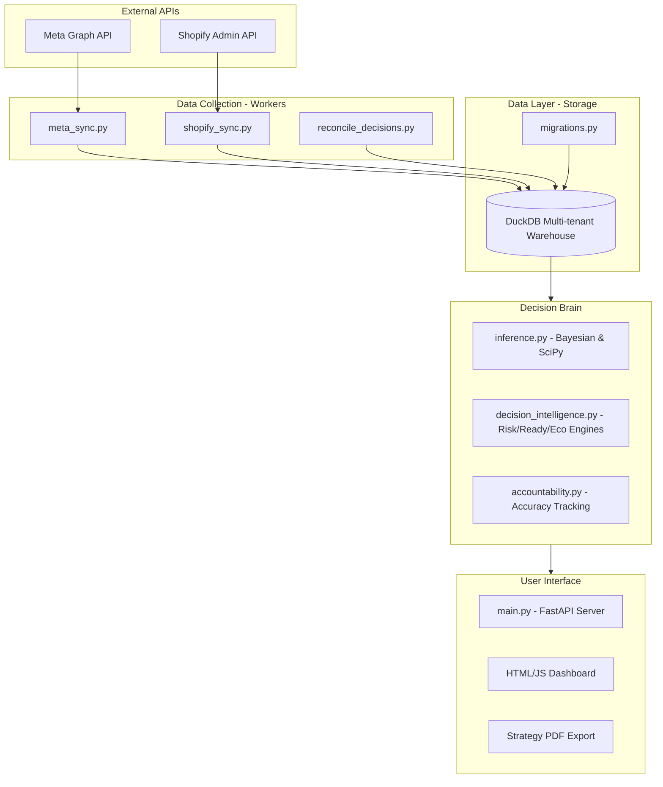
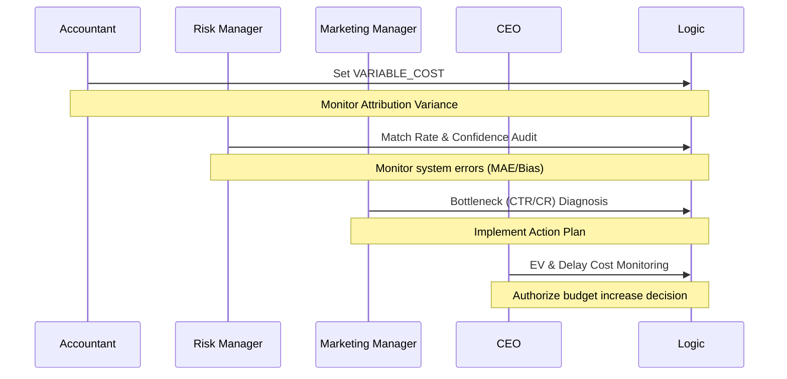

# TrueROAS System Architecture

This document details the technical structure, data processing, and multi-tenant isolation logic of the platform.

---

## 1. High-Level Architecture

---

## 2. Multi-Tenancy & Data Isolation
TrueROAS uses a **Silo Isolation Pattern** for maximum security:
- **Storage:** Each account has a dedicated `.duckdb` file located in `data/tenants/{tenant_id}/warehouse.duckdb`.
- **Encryption:** PII (Personally Identifiable Information) is never stored raw. We use salted BLAKE2b hashing for all customer identifiers.
- **Path Security:** Tenant IDs are sanitized to prevent directory traversal attacks.

---

## 3. Stakeholder Control Loop

