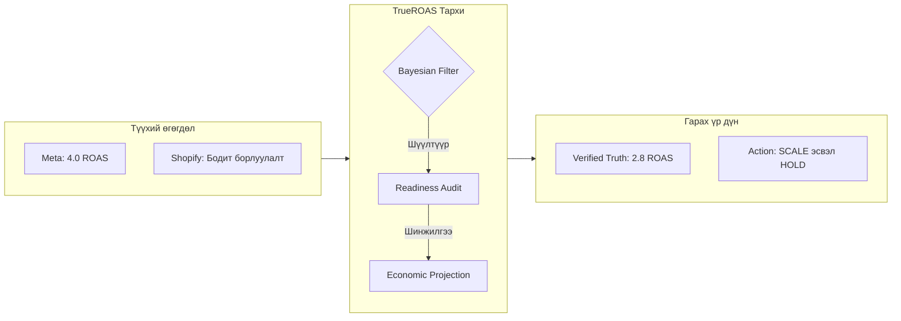
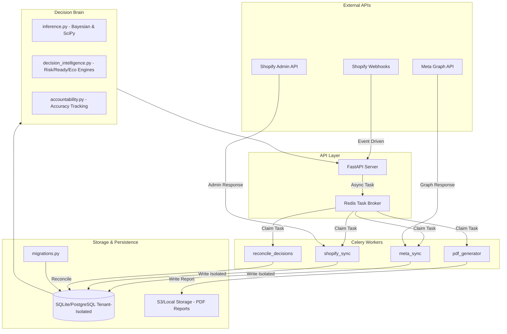
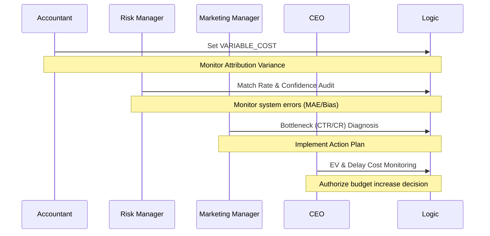

# TrueROAS System Architecture

This document details the technical structure, data processing, and multi-tenant isolation logic of the platform.

*Updated: 2026-06-03*
---

## 0. Системийн ажиллах үндсэн зарчим (Working Principle)

TrueROAS нь маркетингийн платформуудын (Meta, Google) мэдээлдэг хэтрүүлэгтэй датаг бодит борлуулалттай (Shopify) харьцуулан "Үнэний шүүлтүүр" (Bayesian Filter) ашиглан боловсруулдаг.

---
## 1. High-Level Architecture

---

## 2. Multi-Tenancy & Data Isolation
TrueROAS uses a **Silo Isolation Pattern** for maximum security:
- **Storage:** Each account has a dedicated SQLite file located in `data/tenants/{tenant_id}/warehouse.db`.
- **No Central Cloud:** There is no "TrueROAS Cloud". The database is a local file on your hardware.
- **Zero External Outbound:** The application only communicates with Meta and Shopify APIs. It never sends usage reports or business data to any third party.
- **Encryption:** PII (Personally Identifiable Information) is never stored raw. We use salted BLAKE2b hashing for all customer identifiers.
- **Path Security:** Tenant IDs are sanitized to prevent directory traversal attacks.

---

## 3. Stakeholder Control Loop

