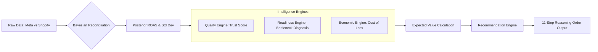

# TrueROAS Decision Intelligence Logic

This document explains the mathematical and recursive reasoning logic used to generate strategic advice.

---

## 1. The 11-Step Reasoning Order
Every recommendation passes through a rigorous auditing chain:
1. **Observation:** Detect divergence between platform and verified revenue.
2. **Evidence:** Quantify reconciliation variance and statistical confidence.
3. **Hypothesis:** Identify likely causes (e.g., attribution overlap).
4. **Decision Cost:** Quantify risk-weighted capital loss of a wrong move.
5. **Delay Cost:** Quantify profit opportunity lost per 14 days of inaction.
6. **Evidence Quality:** Score data integrity (Match Rate & Volatility).
7. **Decision Readiness:** Benchmark funnel physics (CTR/CR) to ensure capacity.
8. **What Must Be True:** Define the performance floor required for success.
9. **Expected Value:** Calculate the probability-weighted financial return.
10. **Recommendation:** Final strategic action (Scale vs. Hold).
11. **Validation Plan:** Post-decision monitoring instructions.

---

## 2. Bayesian Reconciliation
We use a **Normal-Normal Conjugate Prior** to merge platform claims with financial truth:
- **Prior:** Meta's reported ROAS (assumed to be biased).
- **Evidence:** Shopify's reconciled ROAS and daily standard deviation.
- **Posterior:** A synthesized ROAS that "punishes" platform bias based on data volume and stability.

---

## 3. Statistical Core
We utilize the `scipy.stats` library for high-precision modeling:
- **Probability of Profit:** Calculated using the Normal Survival Function (`sf`).
- **Confidence Fan:** Bounds derived from the Percent Point Function (`ppf`) at 10th and 90th percentiles.