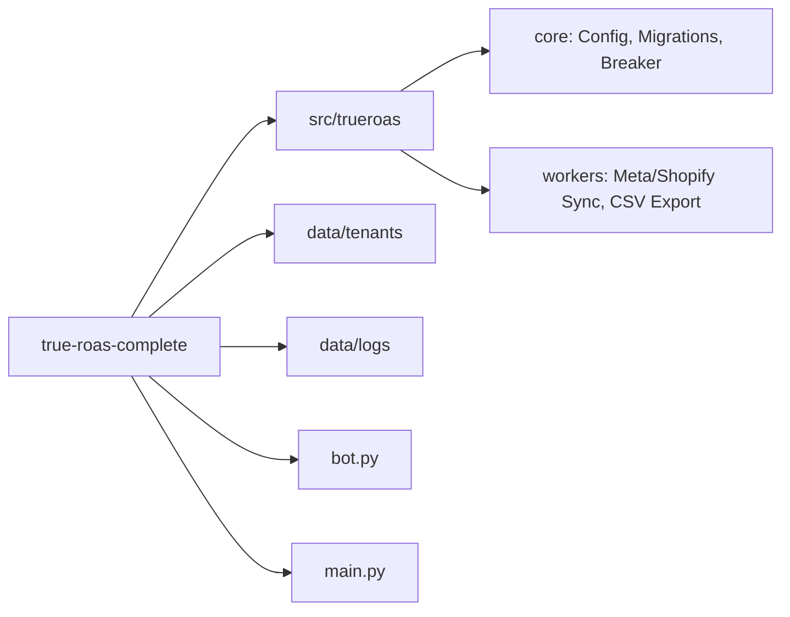

# TrueROAS v1.0 Production 🛡️

TrueROAS is an enterprise-grade precision marketing analytics engine. It reconciles Meta Ads telemetry with actual Shopify financial settlements, identifying the gap between platform reporting and business reality.

> "Meta says 4.2x. Shopify says 2.69x. TrueROAS tells you why."

## 🚀 Overview

TrueROAS provides a single source of truth for e-commerce performance. It transitions from `DEMO_MODE` to `LIVE` by integrating directly with Meta Graph API and Shopify Admin API. The system utilizes a multi-tenant DuckDB OLAP warehouse for high-performance reconciliation and audit scoring.

## 🛠 Features

- **Multi-Tenant Architecture**: Isolated DuckDB databases per tenant with automated schema migrations.
- **Financial Circuit Breaker**: Automated ad spend protection based on daily caps and variance thresholds.
- **Data Privacy**: Salted PII hashing (BLAKE2b/SHA256) ensures customer data is never stored in raw form.
- **Telegram Guardian Bot**: Real-time monitoring and status alerts.
- **Truth Reconciliation**: Accurate ROAS calculation by comparing Meta spend vs. Shopify settled revenue.
- **Automated Maintenance**: Daily background tasks for log rotation and archive purging.

## 📦 Project Structure



## ⚡️ Quick Start

### 1. Configure Environment
Create a `.env` file in the root directory based on the configuration defined in `src/trueroas/core/config.py`.

```env
APP_SECRET_SALT="your-secure-salt-here"
DAILY_SPEND_CAP=500.0
BREAKER_THRESHOLD_MULTIPLIER=2.0
TELEGRAM_BOT_TOKEN="your_bot_token"
META_ACCESS_TOKEN="your_token"
SHOPIFY_TOKEN="your_token"
```

### 2. Start API Server
The server initializes migrations automatically for each tenant on access.
```bash
python main.py
```

### 3. Deploy Guardian Bot
```bash
python bot.py
```

##  API Reference

| Endpoint | Method | Description |
| :--- | :--- | :--- |
| `/` | `GET` | TrueROAS Guardrail Dashboard (HTML) |
| `/api/v1/status` | `GET` | Current 7-day ROAS and spend metrics |
| `/api/v1/sync` | `POST` | Trigger Meta and Shopify data ingestion |
| `/api/v1/guardrail/check` | `POST` | Manually trigger spend cap validation |
| `/api/v1/admin/global-stats` | `GET` | Aggregated metrics across all tenants (Admin) |
| `/api/v1/export/meta-capi-csv`| `GET` | Download the "Truth File" for manual Meta CAPI upload |

## 🛡 Security & Compliance

TrueROAS is built with security as a priority:
- **Zero Raw PII Persistence**: Emails are hashed using a unique application salt + BLAKE2b/SHA256 before any persistence or transmission.
- **Path Traversal Protection**: Tenant IDs are sanitized to prevent unauthorized file system access.
- **Atomic Migrations**: Database updates are wrapped in transactions with automatic rollback on failure.

## 🧪 Marketing ROAS vs Financial ROAS

Standard ad platforms often overstate ROAS due to attribution windows and view-through conversions. TrueROAS measures Meta-specific settled cash in 7-day windows to provide the actual financial return.

### Manual Meta CAPI Upload
1. Download the "Truth File" ZIP from the dashboard or API.
2. Navigate to Meta Events Manager → Data Sources → [Your Pixel].
3. Select "Upload Events" and upload the provided CSV.
4. Meta auto-deduplicates using the deterministic `event_id` to correct Ads Manager reporting.

---
*TrueROAS: Precision over vanity.*
