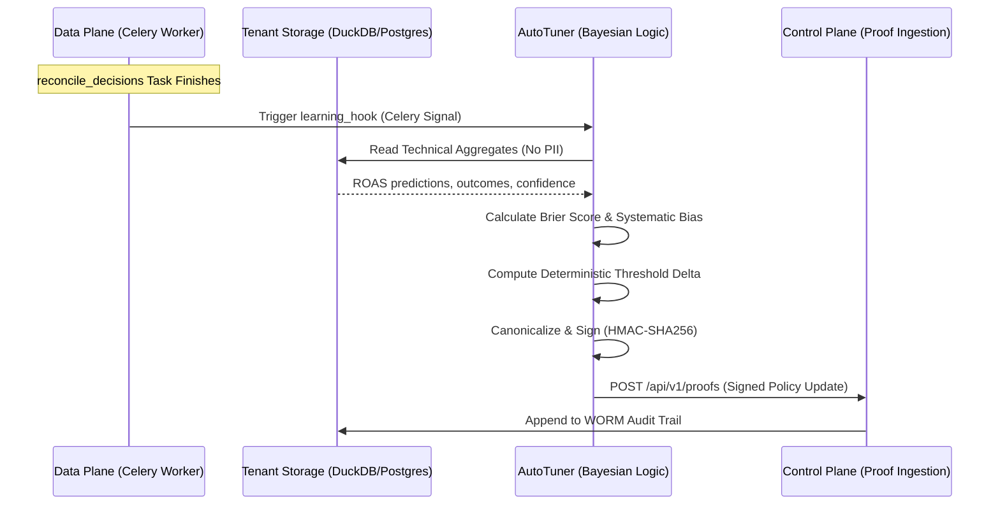

# TrueROAS Zero-Touch Self-Learning System

## Overview
The Learning System adapts strategic thresholds based on the accuracy of past predictions. It utilizes a Bayesian feedback loop to correct systematic bias and minimize Brier Scores.

## Architectural Flow (Zero-Knowledge)

The following diagram illustrates the flow from the Data Plane (Worker) to the Control Plane.



## Security & Compliance
- **Zero-Knowledge:** The `PolicyStore` only retrieves `expected_roas`, `confidence`, and `actual_outcome`. It explicitly ignores `assumptions_json` or customer-related metadata.
- **WORM Compliance:** Every threshold adjustment is treated as a "Strategic Proof," signed on the worker and verified on the server.
- **Determinism:** The Bayesian update is deterministic, allowing auditors to replay the learning cycle from historical data to verify the resulting threshold was valid.

## Configuration
Toggled via `.env`:
- `LEARNING_ENABLED`: (bool) Enables the system.
- `LEARNING_MIN_SAMPLES`: (int) Minimum reconciled decisions required before tuning occurs.

## Migrations
Initialize the learning infrastructure:
```bash
python -m src.trueroas.learning.migrate
```