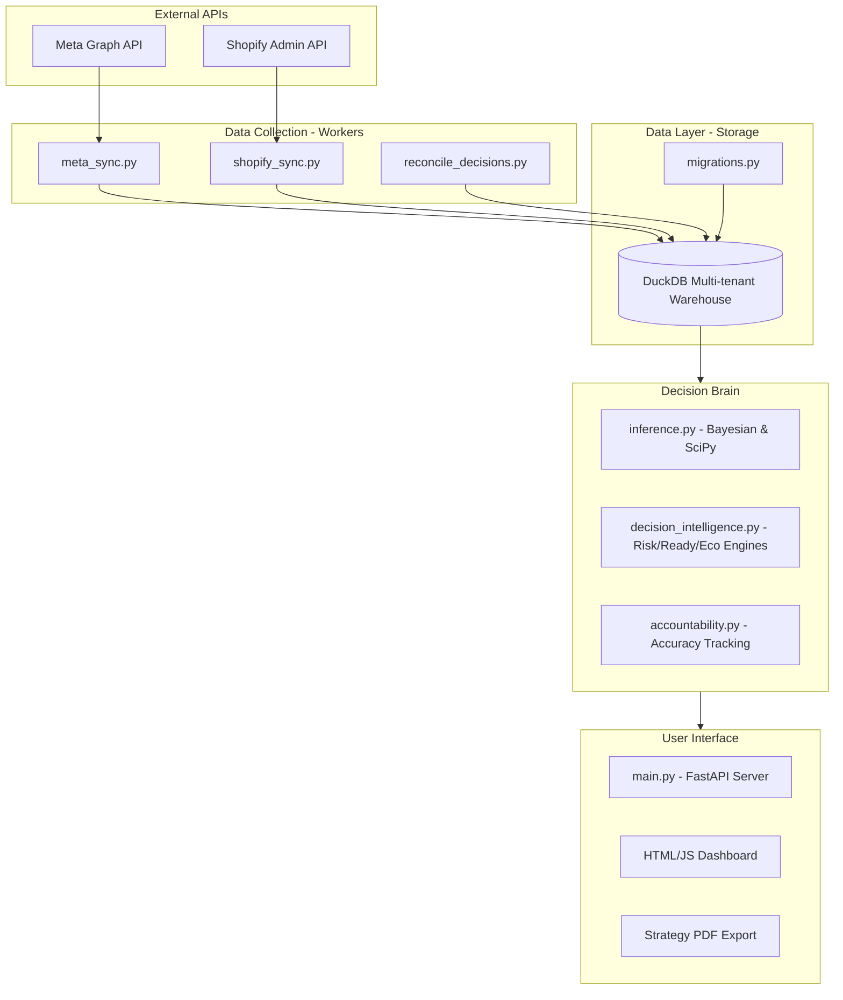
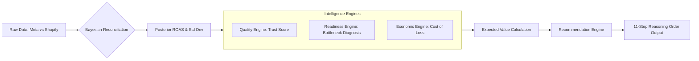
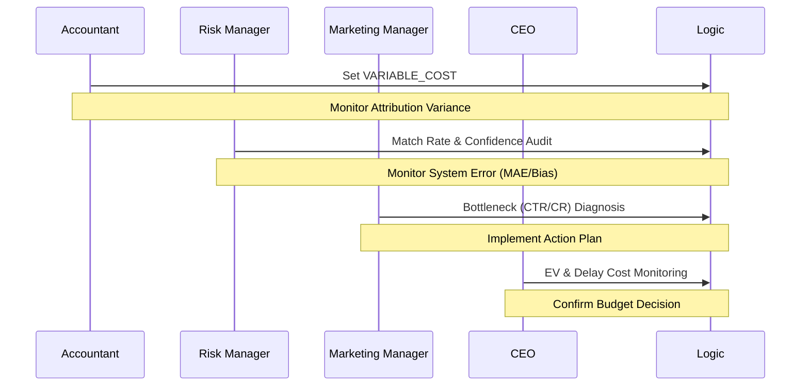

# TrueROAS System Structure & Logic

This document illustrates the technical structure, data processing, and 11-step decision-making logic of the TrueROAS Decision Accountability platform.

---

## 1. High-Level Architecture

TrueROAS consists of four main layers: data collection, processing, diagnosis, and delivery to the user.

---

## 2. Decision Logic Flow

The process of integrating Bayesian probability and economic calculations into "Strategic Advice."

---

## 3. Stakeholder Control Loop

How the four key roles interact with the system to derive value as outlined in the documentation.

---

## 4. File Structure (File Manifest)

*   `main.py`: Central control, API endpoints, and Dashboard.
*   `src/trueroas/core/inference.py`: Statistical calculation core (SciPy/Bayesian).
*   `src/trueroas/core/decision_intelligence.py`: Business logic modules.
*   `src/trueroas/core/migrations.py`: Database schema and automation.
*   `src/trueroas/workers/`: Data ingestion and reconciliation (Sync/Reconcile).
*   `src/trueroas/decision/accountability.py`: System self-error tracking loop.

---
*Documentation updated: 2024-05-31*
**Precision over vanity. Evidence over assumptions. Decisions over dashboards.**